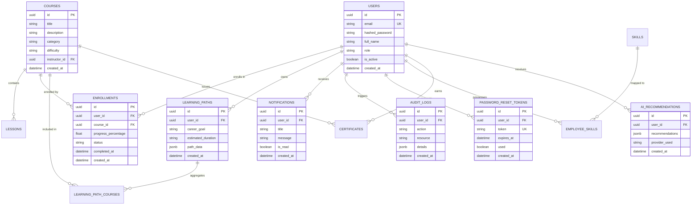

# Database Schema Specification

This document provides a comprehensive technical overview of the relational database schema supporting the **AI Learning Management Platform**.

The database is built on **PostgreSQL (Supabase Serverless)** using **SQLAlchemy 2.0** ORM models.

---

## 📊 Entity-Relationship (ER) Diagram

---

## 🗄️ Table Specifications

### 1. `users`
Stores employee, instructor, and administrator user accounts.

| Column | Type | Constraints | Description |
| :--- | :--- | :--- | :--- |
| `id` | `UUID` | `PRIMARY KEY`, Default `gen_random_uuid()` | Unique user identifier |
| `email` | `VARCHAR(255)` | `UNIQUE`, `NOT NULL`, Indexed | User email address |
| `hashed_password` | `VARCHAR(255)` | `NOT NULL` | Bcrypt hashed password |
| `full_name` | `VARCHAR(255)` | `NOT NULL` | User full name |
| `role` | `VARCHAR(50)` | `NOT NULL`, Default `'student'` | Enum (`student`, `instructor`, `admin`) |
| `is_active` | `BOOLEAN` | Default `TRUE` | Account status flag |
| `created_at` | `TIMESTAMP` | Default `NOW()` | Registration timestamp |

- **Foreign Keys**: None
- **Indexes**: `idx_users_email` (btree)

---

### 2. `courses`
Stores course metadata and curriculum headers created by instructors.

| Column | Type | Constraints | Description |
| :--- | :--- | :--- | :--- |
| `id` | `UUID` | `PRIMARY KEY`, Default `gen_random_uuid()` | Unique course identifier |
| `title` | `VARCHAR(255)` | `NOT NULL` | Course title |
| `description` | `TEXT` | `NOT NULL` | Comprehensive course summary |
| `category` | `VARCHAR(100)` | `NOT NULL`, Indexed | Subject area (e.g. Backend, AI) |
| `difficulty` | `VARCHAR(50)` | Default `'Beginner'` | Level (`Beginner`, `Intermediate`, `Advanced`) |
| `instructor_id` | `UUID` | `FOREIGN KEY` $\rightarrow$ `users(id)` | Creator instructor reference |
| `created_at` | `TIMESTAMP` | Default `NOW()` | Creation timestamp |

- **Foreign Keys**: `instructor_id` references `users(id)` (`ON DELETE SET NULL`)
- **Indexes**: `idx_courses_category` (btree), `idx_courses_instructor_id` (btree)

---

### 3. `lessons`
Individual learning modules and media materials belonging to a course.

| Column | Type | Constraints | Description |
| :--- | :--- | :--- | :--- |
| `id` | `UUID` | `PRIMARY KEY` | Unique lesson identifier |
| `course_id` | `UUID` | `FOREIGN KEY` $\rightarrow$ `courses(id)` | Parent course reference |
| `title` | `VARCHAR(255)` | `NOT NULL` | Lesson title |
| `content` | `TEXT` | `NOT NULL` | Lesson reading material or transcript |
| `order` | `INTEGER` | `NOT NULL` | Sequence position in course |

- **Foreign Keys**: `course_id` references `courses(id)` (`ON DELETE CASCADE`)

---

### 4. `enrollments`
Tracks student course enrollments, completion metrics, and progress percentages.

| Column | Type | Constraints | Description |
| :--- | :--- | :--- | :--- |
| `id` | `UUID` | `PRIMARY KEY` | Unique enrollment ID |
| `user_id` | `UUID` | `FOREIGN KEY` $\rightarrow$ `users(id)` | Enrolled student reference |
| `course_id` | `UUID` | `FOREIGN KEY` $\rightarrow$ `courses(id)` | Target course reference |
| `progress_percentage`| `FLOAT` | Default `0.0` | Progress completion metric (0 - 100%) |
| `status` | `VARCHAR(50)` | Default `'in_progress'` | Enum (`in_progress`, `completed`, `dropped`) |
| `completed_at` | `TIMESTAMP` | Nullable | Completion timestamp |

- **Foreign Keys**: `user_id` references `users(id)`, `course_id` references `courses(id)`
- **Indexes**: `idx_enrollments_user_course` (UNIQUE composite index on `user_id, course_id`)

---

### 5. `learning_paths`
Persists AI-generated personalized career roadmaps for students.

| Column | Type | Constraints | Description |
| :--- | :--- | :--- | :--- |
| `id` | `UUID` | `PRIMARY KEY` | Unique path ID |
| `user_id` | `UUID` | `FOREIGN KEY` $\rightarrow$ `users(id)` | Student owner reference |
| `career_goal` | `VARCHAR(255)` | `NOT NULL` | Target role or skill goal |
| `estimated_duration`| `VARCHAR(100)` | Default `'4 Weeks'` | Roadmap timeframe |
| `path_data` | `JSONB` | `NOT NULL` | Structured weekly module roadmap |
| `created_at` | `TIMESTAMP` | Default `NOW()` | Generation timestamp |

- **Foreign Keys**: `user_id` references `users(id)` (`ON DELETE CASCADE`)

---

### 6. `password_reset_tokens`
Manages secure 1-time password reset URL tokens with expiration timers.

| Column | Type | Constraints | Description |
| :--- | :--- | :--- | :--- |
| `id` | `UUID` | `PRIMARY KEY` | Unique token ID |
| `user_id` | `UUID` | `FOREIGN KEY` $\rightarrow$ `users(id)` | User requesting reset |
| `token` | `VARCHAR(255)` | `UNIQUE`, `NOT NULL`, Indexed | Secure random hex token |
| `expires_at` | `TIMESTAMP` | `NOT NULL` | Token expiration timestamp (15 min) |
| `used` | `BOOLEAN` | Default `FALSE` | Single-use consumption flag |

- **Foreign Keys**: `user_id` references `users(id)` (`ON DELETE CASCADE`)
- **Indexes**: `idx_reset_tokens_token` (btree)

---

### 7. `notifications`
In-app user notification alerts.

| Column | Type | Constraints | Description |
| :--- | :--- | :--- | :--- |
| `id` | `UUID` | `PRIMARY KEY` | Unique notification ID |
| `user_id` | `UUID` | `FOREIGN KEY` $\rightarrow$ `users(id)` | Recipient user ID |
| `title` | `VARCHAR(255)` | `NOT NULL` | Short alert title |
| `message` | `TEXT` | `NOT NULL` | Full alert body content |
| `is_read` | `BOOLEAN` | Default `FALSE` | Read status |

- **Foreign Keys**: `user_id` references `users(id)` (`ON DELETE CASCADE`)

---

### 8. `audit_logs`
Enterprise security logging for administrative and system actions.

| Column | Type | Constraints | Description |
| :--- | :--- | :--- | :--- |
| `id` | `UUID` | `PRIMARY KEY` | Unique log entry ID |
| `user_id` | `UUID` | `FOREIGN KEY` $\rightarrow$ `users(id)` | Action performer reference |
| `action` | `VARCHAR(100)` | `NOT NULL` | Action code (e.g. `COURSE_DELETE`) |
| `resource` | `VARCHAR(255)` | `NOT NULL` | Resource URI / table target |
| `details` | `JSONB` | Nullable | Context metadata payload |
| `created_at` | `TIMESTAMP` | Default `NOW()` | Log timestamp |

---

### 9. `ai_recommendations`
Caches AI recommendation responses generated for users.

| Column | Type | Constraints | Description |
| :--- | :--- | :--- | :--- |
| `id` | `UUID` | `PRIMARY KEY` | Unique recommendation ID |
| `user_id` | `UUID` | `FOREIGN KEY` $\rightarrow$ `users(id)` | Target user ID |
| `recommendations`| `JSONB` | `NOT NULL` | Recommended course objects payload |
| `provider_used` | `VARCHAR(50)` | `NOT NULL` | AI Provider string (`Groq`, `Gemini`) |
