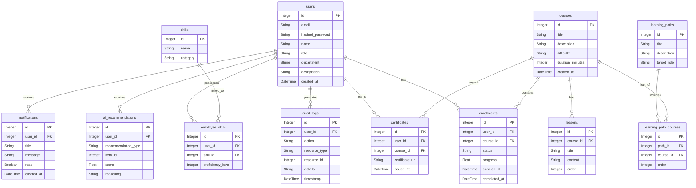

# Database Schema & Architecture

This document provides a comprehensive overview of the PostgreSQL database schema used in the AI Learning Management Platform. The schema is optimized for fast read/writes and integrates fully with Supabase.

---

## 🏗️ Entity Relationship Diagram (ERD)

---

## 🗄️ Tables Detailed Breakdown

### `users`
Stores all employee, manager, and administrator credentials and profiles.
- **`role`**: Defines access control (`admin`, `manager`, `employee`).
- **Indexes**: `ix_users_id`, `ix_users_email` (unique).

### `courses` & `lessons`
Represents the hierarchical learning materials.
- **`courses`**: Top-level containers representing a module.
- **`lessons`**: Sequential content pieces belonging to a course.
- **Foreign Keys**: `lessons.course_id -> courses.id`

### `enrollments`
Tracks learner progress through courses.
- **`status`**: Enums for `enrolled`, `in_progress`, `completed`.
- **`progress`**: Float value from `0.0` to `100.0`.
- **Indexes**: `ix_enrollments_id`.

### `skills` & `employee_skills`
Manages the platform's competency matrix.
- **`skills`**: Master list of competencies (e.g., "Python", "Leadership").
- **`employee_skills`**: Junction table tying users to skills with a `proficiency_level` (1-5).

### `learning_paths` & `learning_path_courses`
Curated journeys for role-specific upskilling.
- **`learning_paths`**: Defines the overarching goal (e.g., "Senior Developer Path").
- **`learning_path_courses`**: Junction table establishing the ordered sequence of courses.

### `certificates`
Automatically generated and tracked when an employee hits 100% course progress.
- **`certificate_url`**: Points to the generated asset (often in Supabase Storage).

### `audit_logs`
Crucial for enterprise compliance.
- Records user interactions, logins, AI queries, and administrative actions.
- **Indexes**: `ix_audit_logs_user_id` for fast user-history lookups.

### `ai_recommendations`
Stores offline/batch computed recommendations generated by Google Gemini.
- **`reasoning`**: Stored LLM explanation of *why* this was recommended, surfaced directly in the UI.

### `notifications`
Real-time alerting system for users.
- Pushed via websockets or long-polling when courses are assigned or deadlines approach.

---

## 🚀 Migration & ORM Notes
- The platform uses **SQLAlchemy 2.0** with `DeclarativeBase`.
- Migrations are managed fully by **Alembic**.
- Alembic tracking table: `alembic_version`.
