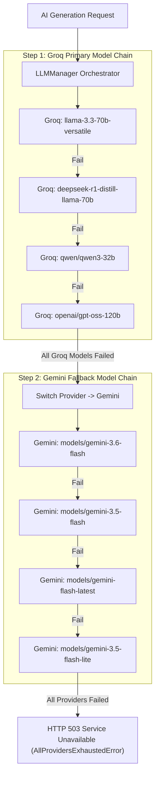

# Migration Guide: Legacy Gemini-Only to Multi-Provider Multi-Model AI Architecture

This guide details the architectural migration of the **AI Learning Management Platform** from a legacy single-model Gemini implementation (`GEMINI_MODEL=models/gemini-2.5-flash`) to a production-grade **Multi-Provider Multi-Model AI Architecture**.

---

## 🎯 Architecture Transformation Summary

| Aspect | Legacy Architecture | New Multi-Provider Architecture |
| :--- | :--- | :--- |
| **Primary Provider** | Google Gemini (Hardcoded) | **Groq Cloud AI** (`PRIMARY_PROVIDER=groq`) |
| **Fallback Provider** | Single Gemini model | **Google Gemini** (`FALLBACK_PROVIDERS=gemini`) |
| **Model Chains** | Hardcoded single model string | **Configurable list chains** (`GROQ_MODELS`, `GEMINI_MODELS`) |
| **Failover Strategy** | Single retry on same model | **Intra-provider model failover $\rightarrow$ Inter-provider failover** |
| **Orchestrator** | Direct `GeminiClient` call | Centralized **`LLMManager`** and **`ProviderRegistry`** |
| **Environment Variable**| `GEMINI_MODEL` | `PRIMARY_PROVIDER`, `GROQ_MODELS`, `GEMINI_MODELS` |
| **Health Monitoring** | Simple boolean check | Granular status via **`GET /health/ai`** |

---

## 🏗️ Failover Execution Hierarchy



---

## 🛠️ Step-by-Step Migration Instructions

### Step 1: Environment Variables Update
Update your `backend/.env` file. Remove `GEMINI_MODEL` and add the new provider configuration:

```diff
- GEMINI_MODEL=models/gemini-2.5-flash
- GEMINI_MAX_RETRIES=3

+ PRIMARY_PROVIDER=groq
+ FALLBACK_PROVIDERS=gemini
+ GROQ_API_KEY=your_groq_api_key_here
+ GROQ_MODELS=llama-3.3-70b-versatile,deepseek-r1-distill-llama-70b,qwen/qwen3-32b,openai/gpt-oss-120b
+ GEMINI_API_KEY=your_gemini_api_key_here
+ GEMINI_MODELS=models/gemini-3.6-flash,models/gemini-3.5-flash,models/gemini-flash-latest
+ AI_TIMEOUT_SECONDS=30.0
+ AI_MAX_RETRIES=2
```

---

### Step 2: Codebase Dependency Migration
All business modules (`AIService`, `RAGService`, `WorkflowEngine`) have been refactored to consume `llm_manager` or `provider_manager` facade.

#### Before (Legacy):
```python
from app.ai.gemini_client import GeminiClient

client = GeminiClient()
response = client.generate_content("Generate roadmap")
```

#### After (Multi-Provider Architecture):
```python
from app.ai.llm_manager import llm_manager

response = llm_manager.generate_content("Generate roadmap")
```

---

### Step 3: Verification
Run the verification test suite to ensure all provider models and failover chains are active:

```bash
cd backend
PYTHONPATH=. python3 -m unittest discover -s tests -p "test_*.py"
```
**Expected Output**: `OK (31 tests passed)`.
