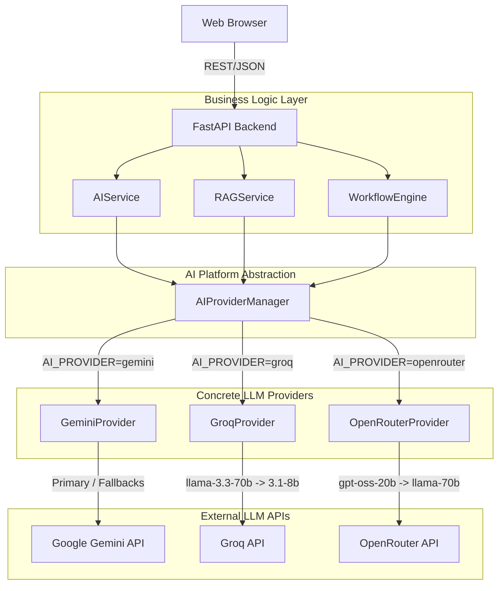

<div align="center">
  <h1>🚀 AI Learning Management Platform</h1>
  <p><strong>Provider-Agnostic AI-Native Learning & Development Ecosystem</strong></p>
  
  [](https://fastapi.tiangolo.com/)
  [](https://reactjs.org/)
  [](https://supabase.com/)
  [](https://ai.google.dev/)
  [](https://groq.com/)
  [](https://openrouter.ai/)
  [](https://www.docker.com/)

  <br />
</div>

## 📖 Overview

The **AI Learning Management Platform (LMS)** is an enterprise-grade ecosystem designed to revolutionize employee training and upskilling. Built with a **Provider-Agnostic AI Architecture**, the platform seamlessly integrates **Google Gemini**, **Groq**, and **OpenRouter**, paired with **ChromaDB** vector storage to power personalized course recommendations, a Retrieval-Augmented Generation (RAG) knowledge base, and automated Multi-Agent learning workflows.

---

## ✨ Key Features

- **🌐 Provider-Agnostic AI Engine**: Seamlessly switch between **Google Gemini**, **Groq**, and **OpenRouter** via environment variables (`AI_PROVIDER=groq`) without code changes.
- **🔄 Multi-Model Failover & Resiliency**: Built-in exponential backoff retries and primary-to-fallback model failovers (e.g. `llama-3.3-70b-versatile` $\rightarrow$ `llama-3.1-8b-instant`).
- **🧠 AI-Powered Recommendations**: Real-time course and skill suggestions tailored to user career goals and current skill gaps.
- **📚 Interactive Knowledge Base**: Chat with enterprise documents using a hybrid search RAG pipeline.
- **🤖 Multi-Agent Architecture**: Autonomous AI agents that summarize lessons, grade assessments, and curate content.
- **🛡️ Enterprise Security**: Role-Based Access Control (RBAC), JWT Authentication, and Supabase RLS.
- **📊 Real-Time Telemetry & Health**: Active model tracking, latency metrics, and real-time provider status checks via `GET /ai/provider-status`.

---

## 🛠️ Technology Stack

| Layer | Technologies |
| :--- | :--- |
| **Frontend** | React, Vite, TailwindCSS, React Router, Recharts, Axios, Lucide Icons |
| **Backend** | Python, FastAPI, SQLAlchemy 2.0, Alembic, Pydantic |
| **Database** | PostgreSQL (Supabase Serverless), Redis (Caching) |
| **AI Providers** | **Google Gemini SDK**, **Groq SDK**, **OpenRouter REST API** |
| **Vector Store** | ChromaDB (hnsw:cosine) |
| **Deployment** | Docker, Docker Compose |

---

## 🏗️ Provider-Agnostic AI Architecture



---

## 📂 Folder Structure

```text
.
├── backend/                            # FastAPI Application
│   ├── app/
│   │   ├── agents/                     # Multi-Agent Workflow Engine & Tools
│   │   ├── ai/                         # Provider-Agnostic AI Layer
│   │   │   ├── providers/              # Concrete Provider Implementations
│   │   │   │   ├── base_provider.py    # Abstract Base Class & Exceptions
│   │   │   │   ├── gemini_provider.py  # Google Gemini Provider
│   │   │   │   ├── groq_provider.py    # Groq Llama Provider
│   │   │   │   └── openrouter_provider.py # OpenRouter API Provider
│   │   │   ├── provider_manager.py     # Unified Provider Manager Facade
│   │   │   ├── ai_service.py           # Business AI Facade
│   │   │   ├── retry_handler.py        # Exponential Backoff Retry Handler
│   │   │   ├── prompt_manager.py       # Versioned Prompt Builders
│   │   │   └── response_parser.py      # Output Sanitization & Validation
│   │   ├── core/                       # App Configuration settings
│   │   ├── database/                   # SQLAlchemy Session & Engine
│   │   ├── rag/                        # Vector Store & Search Pipeline
│   │   ├── routers/                    # REST API Endpoints
│   │   └── schemas/                    # Pydantic Schemas
│   └── tests/                          # Unit & Provider Test Suites
├── frontend/                           # React/Vite Application
│   ├── src/
│   │   ├── components/                 # TopBar, CommandPalette, Modals
│   │   ├── pages/                      # Dashboard, AIAssistant, KnowledgeBase, Admin
│   │   └── services/                   # systemService, API Handlers
└── README.md
```

---

## ⚙️ Environment Variables & Provider Configuration

Switching providers requires **zero code modifications**. Set `AI_PROVIDER` in `backend/.env`:

```env
# Provider Selection (gemini | groq | openrouter)
AI_PROVIDER=groq

# API Keys
GEMINI_API_KEY="your-google-gemini-key"
GROQ_API_KEY="your-groq-api-key"
OPENROUTER_API_KEY="your-openrouter-api-key"

# Optional Model Overrides
PRIMARY_MODEL="llama-3.3-70b-versatile"
FALLBACK_MODELS="llama-3.1-8b-instant"

# Retries & Timeouts
AI_MAX_RETRIES=3
AI_BACKOFF_FACTOR=2.0
AI_REQUEST_TIMEOUT=30.0
```

### Supported Providers & Default Models

| Provider (`AI_PROVIDER`) | Primary Model | Fallback Model | Protocol |
| :--- | :--- | :--- | :--- |
| `gemini` | `models/gemini-3.5-flash` | `models/gemini-3.6-flash`, `models/gemini-flash-latest` | Google GenAI SDK |
| `groq` | `llama-3.3-70b-versatile` | `llama-3.1-8b-instant` | Groq SDK / REST API |
| `openrouter` | `openai/gpt-oss-20b` | `meta-llama/llama-3.1-70b-instruct` | HTTPS REST API |

---

## 🔁 Retry & Failover Mechanism

1. **Model-Level Retry**: On transient errors (429 Rate Limits, 500/503 Server Errors, Network Timeouts), the provider retries up to `AI_MAX_RETRIES` times with exponential backoff (`delay *= 2.0`).
2. **Model Failover**: If the primary model fails after retries, the provider automatically switches execution to its designated fallback model.
3. **Provider Exhaustion**: If all models fail, a clean `ProviderUnavailableException` (HTTP 503) is raised, preventing unhandled SDK crashes and providing structured telemetry logs.

---

## 🧪 Testing

Run the comprehensive test suite verifying Gemini, Groq, OpenRouter providers, ProviderManager, failover, and health endpoints:

```bash
cd backend
PYTHONPATH=. python3 -m unittest discover -s tests -p "test_*.py"
```

---

## 📄 API Endpoints

- `GET /ai/provider-status` : Real-time active provider, model, health status, and fallback models.
- `POST /ai/learning-path` : Structured career roadmap generation.
- `POST /ai/chat`          : Multi-turn conversational AI assistant.
- `GET /system/info`        : Operational indicator status.