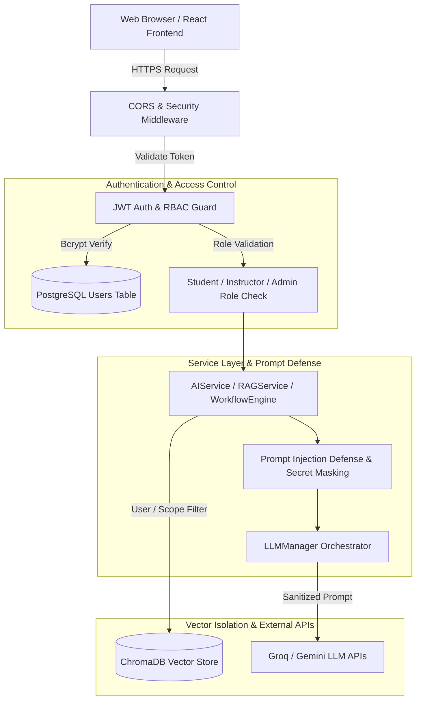

# Security Architecture & Policies

This document outlines the security controls, authentication mechanisms, data protection practices, and threat mitigation strategies implemented in the **AI Learning Management Platform**.

---

## 🛡️ Security Architecture Overview



---

## 🔑 1. Authentication & JWT Controls

### Token Generation & Verification
- **Algorithm**: `HS256` (HMAC with SHA-256).
- **Expiration**: Configured via `ACCESS_TOKEN_EXPIRE_MINUTES` (Default: 30-60 minutes).
- **Payload Schema**:
  ```json
  {
    "sub": "user_id_uuid_string",
    "email": "user@company.com",
    "role": "student",
    "exp": 1785313653
  }
  ```

### Password Hashing
- **Algorithm**: `Bcrypt` with work factor 12.
- Plaintext passwords are **never** stored or written to logs.

---

## 🔐 2. Role-Based Access Control (RBAC)

The platform enforces 3 user roles:

| Role | Access Scope | Enforced By |
| :--- | :--- | :--- |
| `student` | Access enrolled courses, AI Assistant, personal learning paths, knowledge base query. | `get_current_active_user` dependency |
| `instructor` | Create, edit, and delete courses, lessons, and view enrolled student progress. | `get_current_instructor` dependency |
| `admin` | System health diagnostics, user management, audit logs, platform configuration. | `get_current_admin` dependency |

---

## 🛡️ 3. Prompt Injection Defense & Sanitization

1. **System Prompt Encapsulation**: User inputs are strictly wrapped in user-turn messages. System instructions are injected separately via standard API parameter fields (`system_instruction` / `system_message`).
2. **Secret Redaction**: Structured logging sanitizes prompt secrets, API keys, JWT tokens, and emails before writing log entries:
   ```python
   # Sanitization Example
   logger.info(f"AI Request executed for user {user_id} using model {model_name}")
   ```

---

## 🔍 4. Enterprise RAG & Vector Store Safety

1. **Document Isolation**: Document chunk retrieval includes document metadata filtering (`doc_id`, `user_id`, `course_id`) to prevent unauthorized cross-tenant context leaks.
2. **Context Window Boundary**: Retrieved vector context chunks are truncated to fit model context limits, preventing context-overflow attacks.

---

## 🌐 5. CORS & HTTP Security Headers

- **CORS Filtering**: Strict origin validation (`cors_origins` list) and regex pattern matching (`https://.*\.vercel\.app`).
- **Security Headers**:
  - `Strict-Transport-Security: max-age=31536000; includeSubDomains`
  - `X-Content-Type-Options: nosniff`
  - `X-Frame-Options: DENY`
  - `X-XSS-Protection: 1; mode=block`
