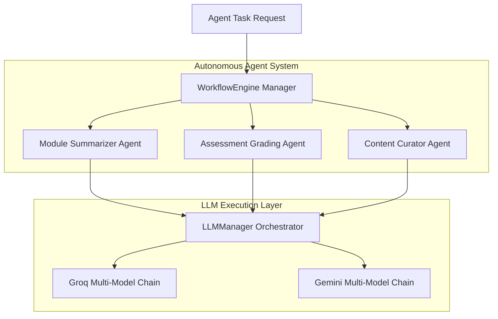

# Multi-Agent Workflow Engine

This document details the autonomous **Multi-Agent Workflow Engine** built into the AI Learning Management Platform.

---

## 🤖 Multi-Agent Architecture

---

## 🛠️ Specialized Agent Roles

### 1. Module Summarizer Agent
- **Purpose**: Generates concise, bulleted executive summaries of dense course modules and video transcripts.
- **Output**: JSON payload with `summary_bullets`, `key_takeaways`, and `estimated_reading_time`.

### 2. Assessment Grading Agent
- **Purpose**: Evaluates student open-ended essay answers against a grading rubric.
- **Output**: Numeric score (0-100), detailed feedback, and suggested areas for improvement.

### 3. Content Curator Agent
- **Purpose**: Analyzes employee skill gaps and generates tailored learning resources and module recommendations.
- **Output**: Curated resource list with difficulty ratings and skill alignment explanations.
