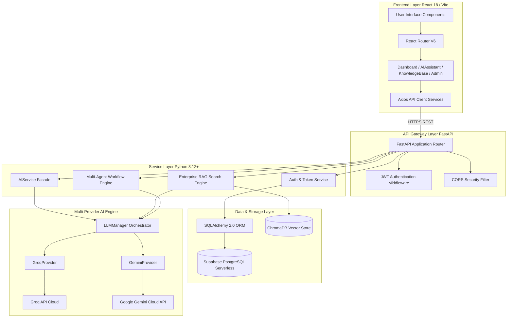
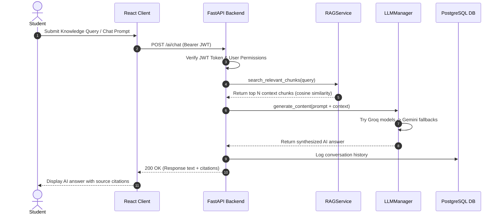

# High-Level System Architecture

This document provides a architectural specification of the **AI Learning Management Platform**.

---

## 🏗️ System Component Architecture

---

## 🔄 End-to-End User Interaction Flow

