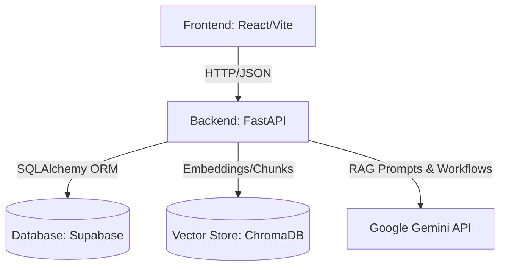

# System Architecture

The AI Learning Management Platform is designed as a modular, decoupled application prioritizing scalability, type-safety, and AI natively integrated into the user experience.

---

## 🏗️ High-Level Topology

## 1. Frontend Architecture (Presentation Layer)

Built on **React 18** and **Vite**, the frontend follows a Component-Based architecture utilizing Context API for global state management.

- **Routing**: `react-router-dom` handles Protected Routes. Unauthenticated users hitting `/dashboard` are dynamically redirected to `/login`.
- **State Management**:
  - `AuthContext`: Tracks JWT validity and stores the current user profile.
  - Local State: React `useState`/`useReducer` for UI state toggles.
- **Styling**: TailwindCSS provides utility-first styling. We heavily utilize glassmorphism aesthetics, gradient text, and CSS Grid/Flexbox layouts. Recharts handles all graphical telemetry (Radars, Lines, Bars).
- **Data Fetching**: `axios` is configured with request interceptors to automatically attach the `Authorization: Bearer <token>` header to all outgoing requests.

## 2. Backend Architecture (Logic & API Layer)

The backend is built with **FastAPI**, renowned for its asynchronous capabilities and automatic OpenAPI (Swagger) generation.

### Module Breakdown
- **`app/main.py`**: The entry point. Mounts the CORS middleware and wires together all APIRouters.
- **`app/routers/`**: The controller layer. Defines HTTP endpoints (e.g., `/auth`, `/courses`, `/ai`), parses incoming JSON using Pydantic, and delegates to the Service Layer.
- **`app/services/`**: The business logic layer. Contains all complex operations, orchestrates database interactions, and ensures controllers remain lightweight.
- **`app/models/`**: SQLAlchemy 2.0 ORM definitions. Each class inherits from `app.database.base.Base` and maps directly to a Supabase table.
- **`app/schemas/`**: Pydantic models. Strictly defines the shape of Data Transfer Objects (DTOs) for request validation and response serialization.
- **`app/dependencies/`**: Dependency Injection (DI) logic. Contains the crucial `get_current_user` and `require_admin` functions that safeguard routes.

## 3. Database Architecture (Data Layer)

We utilize **Supabase Serverless PostgreSQL** for transactional persistence.
- **ORM**: SQLAlchemy manages all CRUD operations abstracting raw SQL.
- **Migrations**: Alembic compares the `app.models` against the Supabase schema and generates auto-migrations (`alembic revision --autogenerate`).

## 4. AI & RAG Architecture (Intelligence Layer)

The platform is "AI-Native", meaning AI is not an afterthought but integrated into the core workflows.

### Retrieval-Augmented Generation (RAG)
1. **Ingestion**: Corporate documents are chunked and embedded via an embedding model.
2. **Storage**: The numerical vectors are stored in **ChromaDB**.
3. **Retrieval**: When a user queries the Knowledge Base, their query is embedded and compared against ChromaDB using cosine similarity.
4. **Generation**: The top-K similar document chunks are injected into a prompt alongside the original query and sent to **Google Gemini 2.0 Flash**, generating an accurate, grounded, and hallucination-free response.

### Multi-Agent System
Located in `app/agents/`, autonomous AI agents collaborate on tasks.
- Agents maintain internal state and memory.
- They invoke specific **tools** (e.g., fetching a user's transcript from the database) to achieve their goals dynamically without hardcoded logic.
