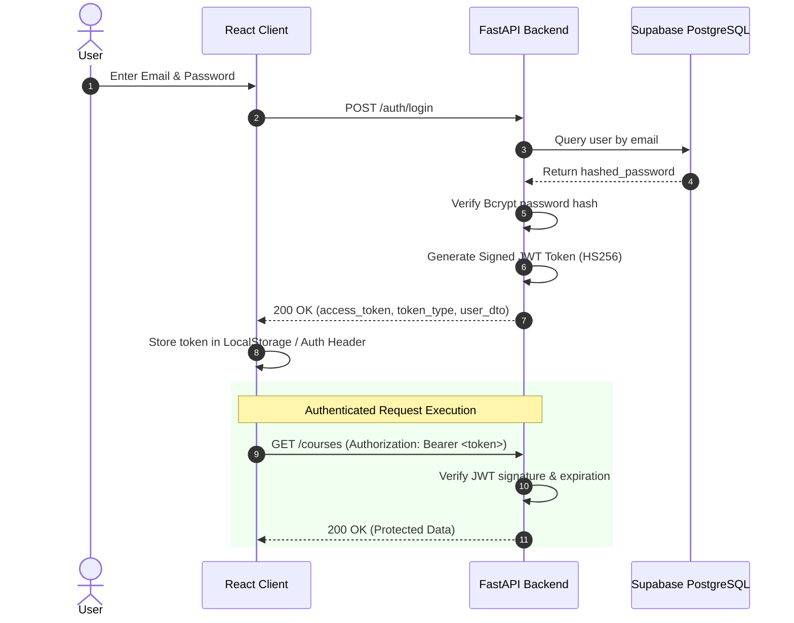

# Authentication & JWT Security Specification

This document details the user authentication workflows, JWT token issuance, password reset mechanics, and Role-Based Access Control (RBAC).

---

## 🔐 JWT Authentication Flow

---

## 🔑 Password Reset Protocol

1. **Request Reset**: User posts email to `POST /auth/forgot-password`.
2. **Token Issue**: Backend creates a 64-character random hex token in `password_reset_tokens` table with `expires_at = NOW() + 15 mins`.
3. **Email Delivery**: Token reset URL is delivered via Resend Email API (`/reset-password?token=...`).
4. **Token Consumption**: User posts new password and token to `POST /auth/reset-password`. Token is marked `used = true`.
