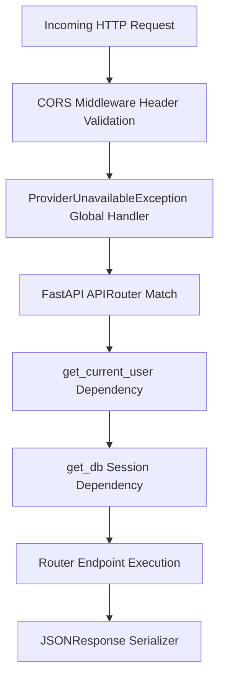

# Backend FastAPI Service Architecture

This document provides a technical specification of the backend application powering the **AI Learning Management Platform**.

---

## 🏗️ Backend Module Organization

```text
backend/app/
├── main.py                     # App entry point, CORS, lifespan banner
├── core/
│   └── config.py               # Pydantic Settings & environment vars
├── database/
│   ├── database.py             # SQLAlchemy Session Local & Engine
│   └── base.py                 # Declarative Base class
├── models/                     # SQLAlchemy ORM Data Models
│   ├── user.py                 # Users & RBAC Roles
│   ├── course.py               # Course Curriculum
│   ├── lesson.py               # Lesson modules
│   ├── enrollment.py           # Student Progress & Enrollments
│   ├── learning_path.py        # AI Learning Path Roadmaps
│   ├── notification.py         # User Notifications
│   ├── audit_log.py            # Administrative Audit Trail
│   └── password_reset_token.py # Security Password Reset Tokens
├── schemas/                    # Pydantic Request & Response DTOs
├── ai/                         # Multi-Provider AI Engine
│   ├── providers/              # BaseProvider, GroqProvider, GeminiProvider
│   ├── provider_registry.py    # Provider Registry
│   ├── llm_manager.py          # Multi-Model Failover Orchestrator
│   └── ai_service.py           # Business AI Facade
├── rag/                        # ChromaDB Hybrid Search Pipeline
│   ├── chroma_db.py            # ChromaDB Client & Vector Store
│   └── rag_service.py          # Chunking, Embedding & Document Ingestion
├── agents/                     # Multi-Agent Workflow Engine
│   └── workflow_engine.py      # Summarizer, Evaluator, Content Curator Agents
└── routers/                    # REST API Endpoints
    ├── auth.py                 # Authentication & Passwords
    ├── courses.py              # Course Management
    ├── ai.py                   # AI Assistant & Learning Paths
    ├── knowledge.py            # RAG Document Management
    ├── agents.py               # Agent Workflow Executions
    ├── health.py               # Diagnostics & Health Monitoring
    └── admin.py                # Admin System Dashboard
```

---

## 🔐 FastAPI Request Lifecycle & Middleware


