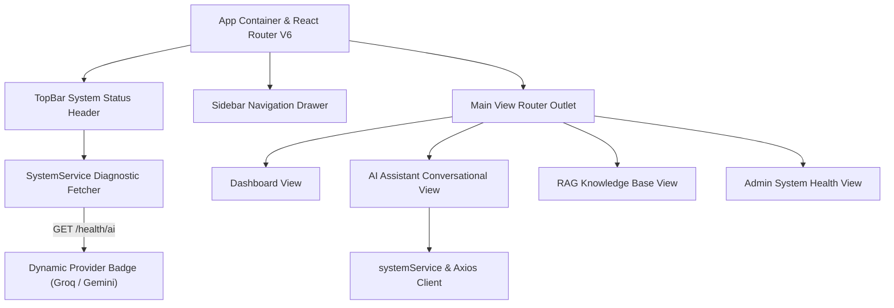

# Frontend React Application Specification

This document details the frontend client application for the **AI Learning Management Platform**.

---

## 🎨 UI Architecture & State Hierarchy

Built with **React 18**, **Vite**, **TailwindCSS**, and **Lucide Icons**.



---

## 🌐 Dynamic Provider Status Badge Integration

The `TopBar.jsx` component queries `systemService.fetchSystemInfo()` on load to display real-time AI provider and active model status:

```javascript
// Dynamic status string formatting in TopBar
const providerName = systemInfo?.provider || "Groq";
const modelName = systemInfo?.model || "llama-3.3-70b-versatile";
const isHealthy = systemInfo?.status === "Operational";

// Display Badge text
`${providerName} (${modelName}) ${isHealthy ? 'Healthy' : 'Degraded'}`
```
