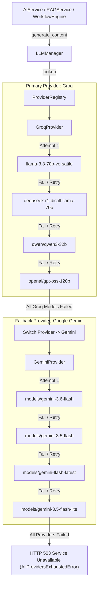
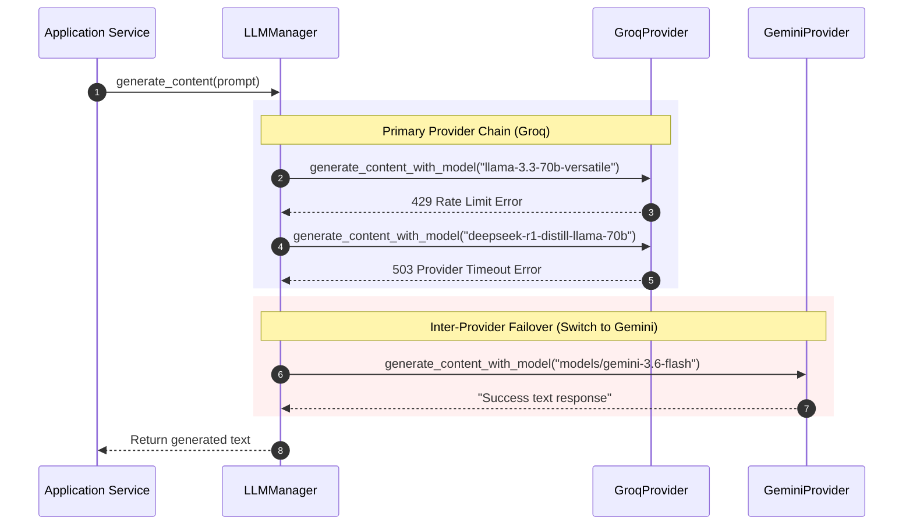

# Multi-Provider Multi-Model AI Architecture

This document provides a technical deep dive into the **Multi-Provider Multi-Model AI Architecture** powering the AI Learning Management Platform.

---

## 🎯 Architecture Overview

The system abstracts LLM interactions behind a provider-agnostic layer. It routes AI requests to **Groq** as the Primary Provider and seamlessly performs model-level and provider-level failovers to **Google Gemini** if Groq models become exhausted or rate-limited.



---

## 🏗️ Core Components

### 1. `BaseProvider` (`app/ai/providers/base_provider.py`)
Abstract base class defining standard LLM provider contracts:
- `generate_content_with_model(model: str, prompt: str, system_instruction: str | None, json_mode: bool) -> str`
- `generate_json_with_model(model: str, prompt: str, system_instruction: str | None) -> dict | list`
- `get_available_models() -> list[str]`
- `provider_name() -> str`
- `health() -> dict[str, Any]`

### 2. `LLMManager` (`app/ai/llm_manager.py`)
Centralized orchestrator managing multi-provider execution:
- Iterates over model chains (`GROQ_MODELS`, `GEMINI_MODELS`).
- Measures execution latency (`latency_ms`).
- Logs attempt details and failover progression.
- Tracks `last_successful_provider` and `last_successful_model`.
- Raises `AllProvidersExhaustedError` if all models fail.

### 3. `ProviderRegistry` (`app/ai/provider_registry.py`)
Singleton registry maintaining active provider implementations:
- `groq` $\rightarrow$ `GroqProvider`
- `gemini` $\rightarrow$ `GeminiProvider`
- `openrouter` $\rightarrow$ `OpenRouterProvider`

---

## 🔄 Failover Sequence Diagram



---

## 📊 Health Monitoring API (`GET /health/ai`)

Returns diagnostic operational telemetry:

```json
{
  "current_provider": "Groq",
  "current_model": "llama-3.3-70b-versatile",
  "available_groq_models": [
    "llama-3.3-70b-versatile",
    "deepseek-r1-distill-llama-70b",
    "qwen/qwen3-32b",
    "openai/gpt-oss-120b"
  ],
  "available_gemini_models": [
    "models/gemini-3.6-flash",
    "models/gemini-3.5-flash",
    "models/gemini-flash-latest"
  ],
  "failover_status": "Operational",
  "last_successful_provider": "Groq",
  "last_successful_model": "llama-3.3-70b-versatile",
  "provider_health": {
    "Groq": "Healthy",
    "Gemini": "Healthy"
  }
}
```
