# Enterprise Retrieval-Augmented Generation (RAG) Engine

This document details the architecture, vector search pipeline, and document ingestion engine powering the **Enterprise Knowledge Base**.

---

## 🏗️ RAG Pipeline Architecture

```mermaid
graph TD
    subgraph Document Ingestion Pipeline
        Doc[PDF / TXT Document Upload] --> Chunker[Recursive Character Text Splitter]
        Chunker -->|500 char chunks / 50 overlap| Embedder[Vector Embedding Engine]
        Embedder -->|Cosine Similarity Matrix| ChromaDB[(ChromaDB Vector Store)]
    end

    subgraph Hybrid Query Retrieval Pipeline
        UserQuery[User Knowledge Query] --> QueryEmbedder[Query Embedding Generator]
        QueryEmbedder --> VectorSearch[ChromaDB ANN Cosine Search]
        VectorSearch --> TopChunks[Top N Vector Chunks]
        TopChunks --> Ranker[Re-Ranking & Score Normalizer]
        Ranker --> ContextFormatter[Context Window Formatter]
        ContextFormatter --> LLMManager[LLMManager Orchestrator]
        LLMManager --> SynthesizedAnswer[Synthesized Response with Citations]
    end
```

---

## 🔍 Ingestion & Hybrid Search Details

1. **Chunking Strategy**: Documents are split into 500-character chunks with a 50-character overlap to preserve semantic continuity across paragraph boundaries.
2. **Metadata Tagging**: Each chunk is persisted in ChromaDB with `doc_id`, `filename`, `user_id`, `chunk_index`, and `created_at` metadata fields.
3. **Deletion Audit Policy**: Document deletions execute transactional removal of both the document database record and all corresponding vector chunks from ChromaDB by `doc_id`.
